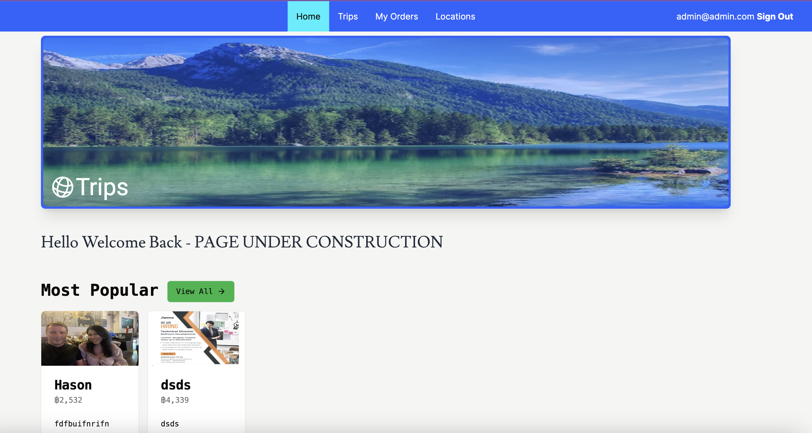
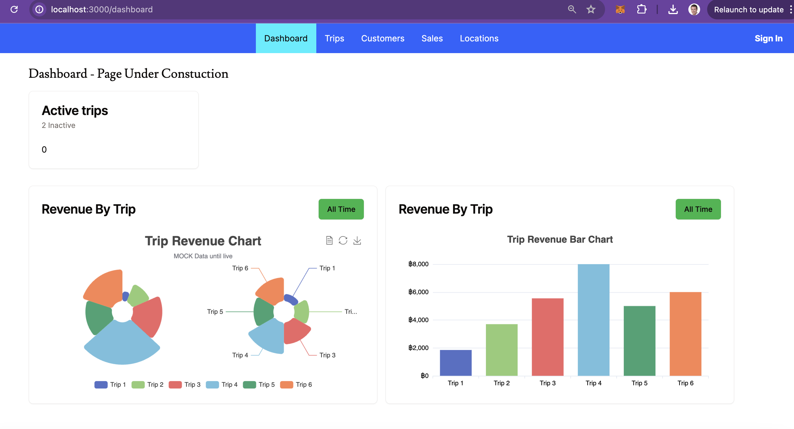

## Ecommerce Project for booking Trips

IN PROGRESS: This is a [Next.js] app that displays hiking trips

NOTE - This is for personal use and updated bit by bit

## Table of Contents
- [Ecommerce Project for booking Trips](#ecommerce-project-for-booking-trips)
- [Table of Contents](#table-of-contents)
- [Tech Stack](#tech-stack)
  - [Features](#features)
  - [Features still to be applied:](#features-still-to-be-applied)
- [Installation and Setup](#installation-and-setup)
- [Environment Variables](#environment-variables)
- [Run Stripe](#run-stripe)
- [Access Dashboard](#access-dashboard)
- [Users](#users)
- [Screenshots](#screenshots)

## Tech Stack
This app includes the following additional libraries:
- Stripe
- Next
- ECharts
- Prisma

### Features
- An Admin system for importing the trips (IN PROGRESS)
- Authorisation (NEXT auth done for sign in for user and admin roles)


### Features still to be applied:
- Management of Admin side
- Orders and Users
- UI on many page
- Display of trips
- Sign up for users
- PostgreSQL
- Pipeline and Vercel
- Unit tests

## Installation and Setup

Clone the repository:

```bash
git clone https://github.com/JackDust24/thai-trips.git
cd trips
```

Run the program:

```bash
npm install
npm run dev
```

## Environment Variables
See env.example

## Run Stripe
Read Stripe docs how to set up and run locally:
```bash
stripe login
stripe listen --forward-to localhost:3000/webhook
```

## Access Dashboard
Need to be logged in as an admin user
```bash
localhost:3000/dashboard
```

## Users
Need Admin access. If own database, add role as admin.

From the envlosed db:
```bash
Admin user > email: test@test.com, password: test1234@
```

Card No: 4242424242424242

## Screenshots

